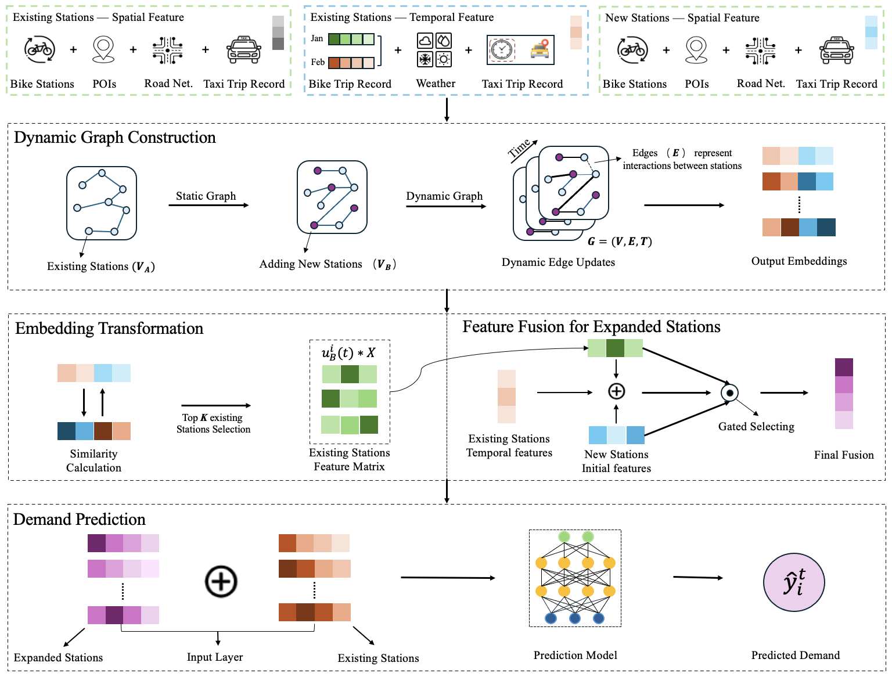

# BGM: Demand Prediction for Expanding Bike-Sharing Systems with Dynamic Graph Modeling

Official implementation of our IJCAI 2025 paper:  
**BGM: Demand Prediction for Expanding Bike-Sharing Systems with Dynamic Graph Modeling**  

---

### 🔍 Overview

The **BGM** framework addresses the key challenge of predicting bike-sharing demand at **newly deployed stations**, where historical data is unavailable.  
To ensure **equitable mobility access** and **efficient operations** in expanding urban systems, BGM captures **dynamic inter-station relationships** via spatio-temporal graph modeling and enhances prediction accuracy through **embedding transfer** and **feature fusion**.



---

### 🧠 Key Features

- **Dynamic Graph Construction**: Models time-evolving spatial and temporal dependencies between existing and new stations.
- **Knowledge Transfer Module**: Learns an orthogonal mapping from existing to new stations using spatial embedding similarities.
- **Feature Fusion Mechanism**: Integrates transferred embeddings with intrinsic features using a gated vector.
- **Spatio-Temporal Alignment**: Includes contrastive and temporal alignment losses to stabilize representation learning across time and stations.

---

### 📊 Experimental Results

Extensive experiments on **NYC Citi-Bike** and **Chicago Divvy-Bike** datasets show that BGM outperforms traditional baselines and recent graph models across all settings, particularly for demand prediction at **new stations**.

| Model           | RMSE (New) ↓ | MAE (New) ↓ |
|----------------|--------------|-------------|
| Linear Regression | 2.36       | 1.98        |
| Function Zone     | 1.91       | 1.36        |
| GraphSAGE         | 2.17       | 1.69        |
| Spatial-MGAT      | 1.83       | 0.99        |
| **BGM (Ours)**     | **1.51**   | **0.85**    |

> ✅ BGM achieves **up to 17.7% lower RMSE** compared to previous state-of-the-art models.

---

### 📂 Code Structure

```
BGM/
├── data/                # Processed Citi-Bike and Divvy-Bike datasets
├── models/              # Model definitions (Graph Encoder, Mapping, Fusion)
├── scripts/             # Training and evaluation scripts
├── utils/               # Preprocessing, metrics, and helpers
├── results/             # Experimental results and logs
└── main.py              # Entry point
```

---

### 🚀 Getting Started

#### Prerequisites
- Python 3.8+
- PyTorch >= 1.11
- NetworkX, NumPy, Pandas, SciPy

#### Setup
```bash
git clone https://github.com/YourUsername/BGM.git
cd BGM
pip install -r requirements.txt
```

#### Run Training
```bash
python main.py --city NYC --mode train
```

#### Evaluate Model
```bash
python main.py --city NYC --mode test
```

---

### 📁 Datasets

We integrate the following public datasets:

- 🛴 **Bike-sharing trip data** (NYC Citi-Bike, Chicago Divvy-Bike)  
- 🌦️ **Weather data** from NYC Mesowest  
- 📍 **POI data** via Google Place API  
- 🚕 **NYC Taxi trips**  
- 🛣️ **Road network** from NYC Open Data

All datasets are available via public APIs or open portals. See `data/README.md` for processing instructions.

### 📬 Contact

If you have any questions, feel free to reach out:

- Yixuan Zhao: [yz776@exeter.ac.uk](mailto:yz776@exeter.ac.uk)  
